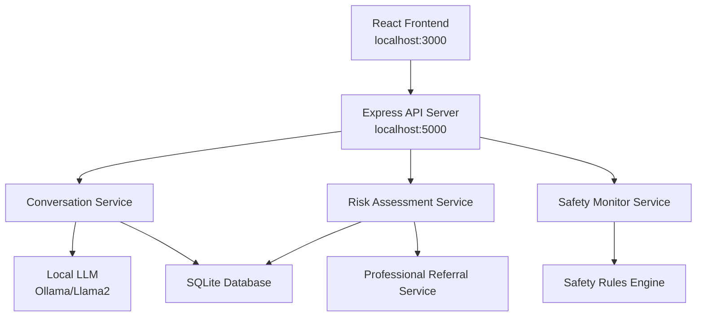

# Mental Health AI Assistant Design Document

## Overview

The Mental Health AI Assistant is a web-based application that provides preliminary mental health support through conversational AI. The system combines natural language processing, risk assessment algorithms, and therapeutic conversation techniques to offer users a safe space for self-reflection while ensuring appropriate professional referrals when needed.

The application follows a client-server architecture with a React-based frontend for user interaction and a Node.js backend that handles conversation processing, risk assessment, and safety protocols.

## Architecture

### High-Level Architecture



### Technology Stack

- **Frontend**: React.js with TypeScript (existing Vite setup)
- **UI Components**: Custom UI library with shadcn/ui components
- **Styling**: Tailwind CSS with custom mental health theme
- **Backend**: Node.js with Express.js framework (to be added)
- **Database**: SQLite for local development (conversation history and user sessions)
- **AI Integration**: Local LLM (Ollama with Llama 2 or similar open-source model)
- **Hosting**: Local development server (localhost)
- **Security**: Input sanitization, rate limiting, local session management

## Components and Interfaces

### Frontend Components (Based on Existing UI Design)

#### Header Component
- Navigation with "MindCare AI" branding and Brain icon
- Menu items: Home, Assessment, Resources, Find Help
- Sign In and Get Started buttons

#### HeroSection Component
- Main landing page with call-to-action buttons
- Feature cards highlighting Quick Assessment, Security, and Professional Network
- Important disclaimer about AI limitations

#### GetStartedPage Component
- Multi-step onboarding flow (welcome, goals, experience, preferences, ready)
- Goal selection with mental health categories
- Experience level assessment
- User preferences for reminders and data sharing

#### AssessmentForm Component
- Progressive questionnaire with 8 mental health screening questions
- Progress tracking and navigation between questions
- Categories: anxiety, depression, stress, sleep, social
- Radio button interface for answer selection

#### ResultsDisplay Component
- Shows assessment results with risk level categorization
- Provides personalized recommendations
- Triggers professional referral for high-risk scores (85%+)

#### ProfessionalDirectory Component
- Lists mental health professionals and resources
- Integration point for referral system

#### ChatInterface Component (To Be Added)
- Real-time conversation with local LLM
- Empathetic response generation
- Safety monitoring and intervention
- Session management and history

### Backend Services

#### ConversationService
```typescript
interface ConversationService {
  processMessage(userId: string, message: string): Promise<AIResponse>
  generateEmpathicResponse(userInput: string, context: ConversationContext): Promise<string>
  applyCounselingTechniques(message: string): Promise<string>
  callLocalLLM(prompt: string): Promise<string> // Integration with Ollama API
}
```

#### RiskAssessmentService
```typescript
interface RiskAssessmentService {
  assessRisk(conversationHistory: Message[], currentMessage: string): Promise<RiskScore>
  calculateMentalHealthIndicators(messages: Message[]): Promise<IndicatorScores>
  shouldTriggerReferral(riskScore: RiskScore): boolean
}
```

#### SafetyMonitorService
```typescript
interface SafetyMonitorService {
  scanForHarmfulContent(message: string): Promise<SafetyFlags>
  preventHarmfulSuggestions(aiResponse: string): Promise<string>
  handleCrisisDetection(userId: string, riskLevel: number): Promise<CrisisResponse>
}
```

## Data Models

### User Session
```typescript
interface UserSession {
  sessionId: string
  startTime: Date
  lastActivity: Date
  riskScore: number
  conversationHistory: Message[]
  referralTriggered: boolean
}
```

### Message
```typescript
interface Message {
  id: string
  sessionId: string
  content: string
  sender: 'user' | 'assistant'
  timestamp: Date
  riskIndicators: RiskIndicator[]
  empathyScore: number
}
```

### Risk Assessment
```typescript
interface RiskScore {
  overallRisk: number // 0-100 percentage
  indicators: {
    depressionMarkers: number
    anxietyMarkers: number
    selfHarmRisk: number
    suicidalIdeation: number
    socialIsolation: number
  }
  confidence: number
  recommendsProfessionalHelp: boolean
}
```

### Safety Flags
```typescript
interface SafetyFlags {
  containsHarmfulContent: boolean
  riskLevel: 'low' | 'medium' | 'high' | 'crisis'
  flaggedTerms: string[]
  requiresIntervention: boolean
}
```

## Error Handling

### Safety-First Error Handling
- All errors default to safe, supportive responses
- System failures trigger gentle redirection to professional resources
- No error messages that could increase user distress

### Graceful Degradation
- If AI service is unavailable, provide pre-written supportive messages
- Maintain conversation history even during service interruptions
- Ensure referral system works independently of main conversation flow

### Crisis Handling Protocol
1. Immediate detection of crisis language
2. Override normal conversation flow
3. Provide crisis resources (hotlines, emergency contacts)
4. Log incident for review (anonymized)
5. Graceful transition back to supportive conversation if appropriate

## Testing Strategy

### Unit Testing
- Test individual counseling response generation
- Validate risk assessment algorithms with known scenarios
- Test safety filter effectiveness against harmful content database

### Integration Testing
- End-to-end conversation flows
- Risk assessment triggering referral system
- Safety monitor integration with conversation service

### Ethical Testing
- Test responses to various mental health scenarios
- Validate empathy and appropriateness of AI responses
- Ensure no harmful suggestions are generated under any circumstances

### User Acceptance Testing
- Test with mental health professionals for clinical appropriateness
- Validate user experience with target demographic
- Test accessibility features for users with different needs

### Safety Testing
- Red team testing for harmful response generation
- Crisis scenario testing
- Professional referral accuracy testing

## Security and Privacy Considerations

### Data Protection
- Store conversation data locally in SQLite database
- Implement session-based storage (no permanent user accounts required)
- Automatic data deletion after session ends or on application restart
- All data remains on local machine for privacy

### Content Filtering
- Multi-layer content filtering for harmful suggestions
- Real-time monitoring of AI responses
- Human oversight for high-risk conversations

### Rate Limiting
- Prevent abuse through conversation limits
- Implement cooling-off periods for high-risk sessions
- Monitor for unusual usage patterns

## Professional Integration

### Referral System
- Maintain database of local mental health resources
- Provide multiple referral options (crisis lines, therapists, support groups)
- Include both immediate crisis resources and ongoing care options

### Compliance Considerations
- Clear disclaimers about AI nature and limitations
- Explicit statements about not replacing professional care
- Documentation of when and why referrals are made
## Loc
al Development Setup

### Prerequisites
- Node.js (v18 or higher)
- Ollama installed locally for LLM integration
- SQLite for local database

### Local LLM Integration
- Use Ollama to run Llama 2 or similar open-source model locally
- API endpoint: http://localhost:11434/api/generate
- Model selection: llama2:7b or llama2:13b depending on system capabilities
- Custom prompts designed for mental health counseling scenarios

### Development Workflow
1. Start Ollama service with chosen model
2. Initialize SQLite database with required tables
3. Start Express backend server on localhost:5000
4. Start React development server on localhost:3000
5. All data processing happens locally without external API calls