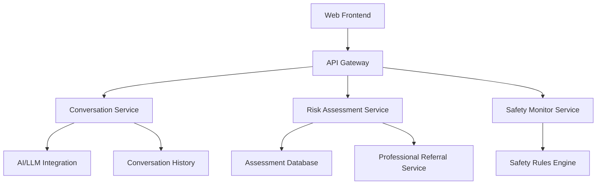

# Mental Health AI Assistant Design Document

## Overview

The Mental Health AI Assistant is a web-based application that provides preliminary mental health support through conversational AI. The system combines natural language processing, risk assessment algorithms, and therapeutic conversation techniques to offer users a safe space for self-reflection while ensuring appropriate professional referrals when needed.

The application follows a client-server architecture with a React-based frontend for user interaction and a Node.js backend that handles conversation processing, risk assessment, and safety protocols.

## Architecture

### High-Level Architecture



### Technology Stack

- **Frontend**: React.js with TypeScript for type safety
- **Backend**: Node.js with Express.js framework
- **Database**: MongoDB for conversation history and user sessions
- **AI Integration**: OpenAI API or similar LLM service
- **Hosting**: AWS (EC2, S3, CloudFront for CDN)
- **Security**: HTTPS, input sanitization, rate limiting

## Components and Interfaces

### Frontend Components

#### ChatInterface Component
- Handles user input and message display
- Implements responsive design for mobile and desktop
- Manages real-time conversation flow
- Displays empathetic UI elements (warm colors, supportive messaging)

#### WelcomeScreen Component
- Provides clear introduction to the assistant's capabilities
- Explains limitations and when to seek professional help
- Includes disclaimer about AI nature of the service

#### ReferralModal Component
- Displays when risk assessment triggers professional referral
- Provides local mental health resources and crisis hotlines
- Offers gentle guidance without causing alarm

### Backend Services

#### ConversationService
```typescript
interface ConversationService {
  processMessage(userId: string, message: string): Promise<AIResponse>
  generateEmpathicResponse(userInput: string, context: ConversationContext): Promise<string>
  applyCounselingTechniques(message: string): Promise<string>
}
```

#### RiskAssessmentService
```typescript
interface RiskAssessmentService {
  assessRisk(conversationHistory: Message[], currentMessage: string): Promise<RiskScore>
  calculateMentalHealthIndicators(messages: Message[]): Promise<IndicatorScores>
  shouldTriggerReferral(riskScore: RiskScore): boolean
}
```

#### SafetyMonitorService
```typescript
interface SafetyMonitorService {
  scanForHarmfulContent(message: string): Promise<SafetyFlags>
  preventHarmfulSuggestions(aiResponse: string): Promise<string>
  handleCrisisDetection(userId: string, riskLevel: number): Promise<CrisisResponse>
}
```

## Data Models

### User Session
```typescript
interface UserSession {
  sessionId: string
  startTime: Date
  lastActivity: Date
  riskScore: number
  conversationHistory: Message[]
  referralTriggered: boolean
}
```

### Message
```typescript
interface Message {
  id: string
  sessionId: string
  content: string
  sender: 'user' | 'assistant'
  timestamp: Date
  riskIndicators: RiskIndicator[]
  empathyScore: number
}
```

### Risk Assessment
```typescript
interface RiskScore {
  overallRisk: number // 0-100 percentage
  indicators: {
    depressionMarkers: number
    anxietyMarkers: number
    selfHarmRisk: number
    suicidalIdeation: number
    socialIsolation: number
  }
  confidence: number
  recommendsProfessionalHelp: boolean
}
```

### Safety Flags
```typescript
interface SafetyFlags {
  containsHarmfulContent: boolean
  riskLevel: 'low' | 'medium' | 'high' | 'crisis'
  flaggedTerms: string[]
  requiresIntervention: boolean
}
```

## Error Handling

### Safety-First Error Handling
- All errors default to safe, supportive responses
- System failures trigger gentle redirection to professional resources
- No error messages that could increase user distress

### Graceful Degradation
- If AI service is unavailable, provide pre-written supportive messages
- Maintain conversation history even during service interruptions
- Ensure referral system works independently of main conversation flow

### Crisis Handling Protocol
1. Immediate detection of crisis language
2. Override normal conversation flow
3. Provide crisis resources (hotlines, emergency contacts)
4. Log incident for review (anonymized)
5. Graceful transition back to supportive conversation if appropriate

## Testing Strategy

### Unit Testing
- Test individual counseling response generation
- Validate risk assessment algorithms with known scenarios
- Test safety filter effectiveness against harmful content database

### Integration Testing
- End-to-end conversation flows
- Risk assessment triggering referral system
- Safety monitor integration with conversation service

### Ethical Testing
- Test responses to various mental health scenarios
- Validate empathy and appropriateness of AI responses
- Ensure no harmful suggestions are generated under any circumstances

### User Acceptance Testing
- Test with mental health professionals for clinical appropriateness
- Validate user experience with target demographic
- Test accessibility features for users with different needs

### Safety Testing
- Red team testing for harmful response generation
- Crisis scenario testing
- Professional referral accuracy testing

## Security and Privacy Considerations

### Data Protection
- Encrypt all conversation data at rest and in transit
- Implement session-based storage (no permanent user accounts required)
- Automatic data deletion after session ends
- Comply with healthcare privacy standards where applicable

### Content Filtering
- Multi-layer content filtering for harmful suggestions
- Real-time monitoring of AI responses
- Human oversight for high-risk conversations

### Rate Limiting
- Prevent abuse through conversation limits
- Implement cooling-off periods for high-risk sessions
- Monitor for unusual usage patterns

## Professional Integration

### Referral System
- Maintain database of local mental health resources
- Provide multiple referral options (crisis lines, therapists, support groups)
- Include both immediate crisis resources and ongoing care options

### Compliance Considerations
- Clear disclaimers about AI nature and limitations
- Explicit statements about not replacing professional care
- Documentation of when and why referrals are made